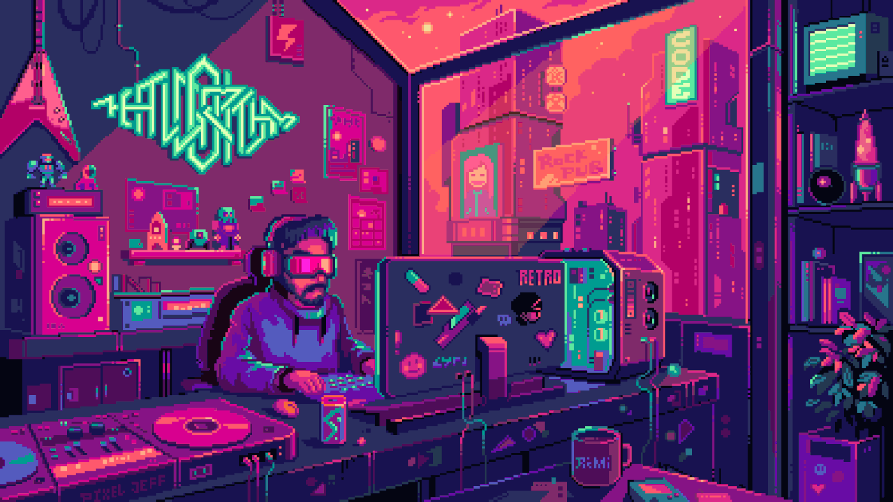

 

<table align="center">
	<tr>
		<td align="center" width="50%">
			
		</td>
		<td align="center" width="50%">
			
		</td>
	</tr>
</table>

 

---

## Sobre mim

### Francisco Fernandes

**Full Stack Developer** com foco em backend robusto, produtos com impacto real e arquitetura orientada a escala.

<table align="center">
	<tr>
		<td width="50%" valign="top">

**Impacto prático**

Sistemas em produção para cenários públicos e operacionais, com foco em estabilidade e resultado.

**Interesses técnicos**

IA aplicada à saúde, automação de processos e arquitetura de software.

		</td>
		<td width="50%" valign="top">

**Qualidade de entrega**

Código limpo, escalável e com manutenção previsível.

**Direção atual**

APIs, integrações, observabilidade e infraestrutura cloud com Docker e CI/CD.

		</td>
	</tr>
</table>

---

## Destaques

<table>
	<tr>
		<td width="50%" valign="top">

### Sistemas em produção

Fluxos reais para atendimento, agendamento e operação com foco em confiabilidade.

### Backend

APIs, autenticação, integrações e regras de negócio com arquitetura bem definida.

		</td>
		<td width="50%" valign="top">

### IA na saúde

Predição, segmentação e classificação de exames em projetos aplicados.

### Infraestrutura

Docker, Nginx, VPS, CI/CD e cloud para deploy contínuo e ambiente estável.

		</td>
	</tr>
</table>

---

## Tech Stack

### Front-end

### Back-end

### Banco de dados

### DevOps e cloud

### Ferramentas

---

## Métricas

  

---

## Snake

<picture>
	<source media="(prefers-color-scheme: dark)" srcset="https://raw.githubusercontent.com/valesecond/valesecond/output/github-contribution-grid-snake-dark.svg" />
	<source media="(prefers-color-scheme: light)" srcset="https://raw.githubusercontent.com/valesecond/valesecond/output/github-contribution-grid-snake.svg" />
	
</picture>

